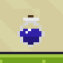
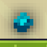
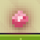
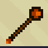
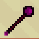

# Magic Platformer

Magic platformer is a competitive game to be played with your friends. It is a
dynamic 2D arcade platformer, where the main objective is to be the last one alive.
Gameplay revolves around using various spells to deal damage your opponent(s),
while simultaneously running and jumping on platforms to avoid being hit and
collect pick-ups.

## Installation

You have two options to install the game. You can either download the latest
release, or build the game yourself in Unity.

### Downloading the latest release
To download the latest release, go to the [releases](/releases/latest) page and
choose the appropriate file for your platform.

**Note:** The releases have been tested only on Windows 10 and Linux (Fedora 38).

### Opening in Unity

To open the project in Unity, you need to have the Unity editor installed.
Clone the repository, using the following command:

```bash
git clone https://github.com/Wolokin/MagicPlatformer.git
```

Then open the project in Unity by selecting the `MagicPlatformer` folder.

## Quick start

### Start menu

After running the game, you will be greeted with the start menu. From here, you
can select the number of players (2-4), the skin of each player and the input
they will use.<br>
**Note**: for the player to spawn, the input needs to be present,
i.e. if you select a controller as an input, but there is no controller
connected, the player will not spawn.

When you're ready with your selections, proceed to select 'Map 1' at the bottom
to start playing.

### Movement & Controls

The following table describes the control schemes for both keyboard and controller inputs:

| Actions | Keyboard Scheme 1 | Keyboard Scheme 2 | Controller Scheme |
|---------|-------------------|-------------------|-------------------|
| Move    | Arrow keys        | WASD              | Left stick        |
| Jump    | Z                 | Space             | A                 |
| Dash    | Left Control      | Left Control      | Left Trigger      |
| Grab    | Left Shift        | Left Shift        | Left Shoulder     |
| Cast    | X                 | E                 | Right Shoulder    |

### Pick-ups

There are currently six pick-ups in total in the game. Four of them grant
different bonuses, like health restoration and speed boost, and two of them are
wands, that give you access to new spells.

Pick-ups are spawned very often as long as there is less than 10 of them on the map.

Everything is summarized in the following table:


| Icon                            | Action                                                            |
|---------------------------------|-------------------------------------------------------------------|
|  | Restores 25 health point                                          |
|    | Restores 25 mana point                                            |
|    | Increases the speed of the spell projectile by 10%                |
|      | Increases spell's damage by 15%                                   |
|      | Replaces the current spell with an exploding fireball             |
|   | Replaces the current spell with slow but high-damage damage spell |


## Inspirations

Movement in our game is inspired by [Celeste](https://store.steampowered.com/app/504230/Celeste/).

## Used Assets

All assets used in this project were acquired from free sources. Most notably:
 - [Pixel Adventure 1](https://assetstore.unity.com/packages/2d/characters/pixel-adventure-1-155360)
 - [RPG Fantasy Items](https://assetstore.unity.com/packages/2d/rpg-fantasy-items-193591)
 - [Free 2D Mega Pack](https://assetstore.unity.com/packages/2d/free-2d-mega-pack-177430)
 - [Thaleah Pixel Font](https://assetstore.unity.com/packages/2d/fonts/free-pixel-font-thaleah-140059)
